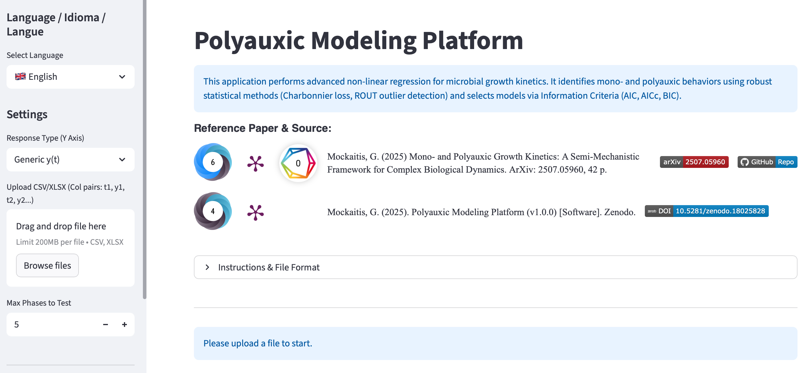

# Summary

The **Polyauxic Modeling Platform** is an open-source Python tool designed to automate the kinetic modeling of complex microbial growth patterns, specifically focusing on mono- and polyauxic (multiphasic) behaviors. In predictive microbiology and industrial biotechnology, accurately estimating kinetic parameters—such as the maximum specific growth rate ($r_{max}$) and the lag phase duration ($\lambda$)—is critical for process control and scale-up.

While classical empirical models (e.g., Gompertz, Boltzmann, Logistic) effectively describe simple single-phase growth, they fail to capture the sequential substrate consumption (diauxie, triauxie) often observed in complex media, such as lignocellulosic hydrolysates or industrial wastewaters. This software implements the semi-mechanistic framework proposed by @Mockaitis:2025, treating polyauxic growth as a weighted summation of reformulated sigmoidal phases. It features a high-performance hybrid optimization engine to resolve the multi-modal parameter landscapes inherent to these complex models, accessible via a user-friendly Streamlit interface.

# Statement of Need

Modeling multiphasic microbial growth presents significant computational challenges that are not adequately addressed by standard statistical software (e.g., GraphPad Prism, Excel) or general-purpose fitting libraries:

1.  **High-Dimensional Non-Convexity:** Polyauxic models with $n$ phases often contain $3n + 2$ parameters. The objective function (Sum of Squared Errors) typically exhibits multiple local minima, making standard gradient-descent algorithms highly sensitive to initial guesses.
2.  **Constraint Handling:** Biologically meaningful solutions require strict temporal ordering of phases (e.g., $\lambda_1 < \lambda_2 < \dots < \lambda_n$). Implementing these dynamic inequality constraints in general-purpose tools is non-trivial for experimentalists.
3.  **Reproducibility:** Manual heuristic initialization ("eyeballing" start parameters) introduces bias. A robust tool must offer an automated, deterministic workflow to ensure that results are reproducible across different research groups.

The **Polyauxic Modeling Platform** addresses these needs by providing a Python-based workflow that integrates:
* **Semi-mechanistic model formulations** for Gompertz and Boltzmann equations.
* **Automated outlier detection** using the Robust Regression and Outlier Removal (ROUT) method.
* **A hybrid optimization strategy** that eliminates the need for manual parameter initialization.
* **Stability analysis** tools to assess numerical robustness against random seed variations.

# Mathematics and Implementation

## Semi-Mechanistic Formulations
The software implements reformulated versions of sigmoid functions where the parameters of interest ($r_{max}$, $\lambda$) appear explicitly. For a polyauxic system with $n$ phases, the biomass concentration $y(t)$ is modeled as a summation:

$$y(t) = y_i + (y_f - y_i) \sum_{j=1}^{n} p_j \cdot f(t, r_{max,j}, \lambda_j)$$

Where $y_i$ and $y_f$ are initial and final biomass, $p_j$ is the fractional contribution of phase $j$ (subject to $\sum p_j = 1$), and $f(t)$ is the normalized sigmoidal kernel (Gompertz or Boltzmann).

## Hybrid Optimization Engine
To solve the non-linear regression problem without user-supplied guesses, the software employs a two-stage strategy using `scipy.optimize` [@Virtanen:2020]:

1.  **Global Search (Stochastic):** The algorithm first employs **Differential Evolution (DE)**, a stochastic genetic algorithm. DE is robust against local minima and explores the global parameter space to find the basin of attraction for the optimal solution.
2.  **Local Refinement (Gradient-based):** The best candidate vector from the DE stage is passed as the initial guess to the **L-BFGS-B** algorithm (Limited-memory Broyden–Fletcher–Goldfarb–Shanno with Bounds). This step polishes the parameters to high precision and ensures convergence to the exact local minimum.

## Software Architecture
The package is structured into a modular library (`polyauxic_lib.py`) handling the mathematics and a graphical frontend (`app.py`).

* **Data Handling:** `pandas` is used for ingesting CSV/XLSX datasets and handling replicates.
* **Visual Interface:** Built with `streamlit`, allowing users to upload data, toggle model types (Gompertz vs. Boltzmann), apply constraints (Floating vs. Forced Intercept), and visualize fitting results interactively.
* **Stability Metrics:** The software includes a module to generate "Response Surfaces" (Heatmaps), visualizing the standard deviation of the Akaike Information Criterion (AICc) across multiple random seeds. This allows users to empirically verify the numerical stability of the model configuration.

# Example Usage

The tool allows researchers to compare conflicting hypotheses (e.g., "Is this growth profile diauxic or triauxic?") by fitting models with $n=1$ to $n=5$ phases and comparing them via Information Criteria (AICc).

# Acknowledgements

We acknowledge the financial support from the State of São Paulo Research Foundation (FAPESP) and the infrastructure provided by the School of Agricultural Engineering at UNICAMP.

# References
